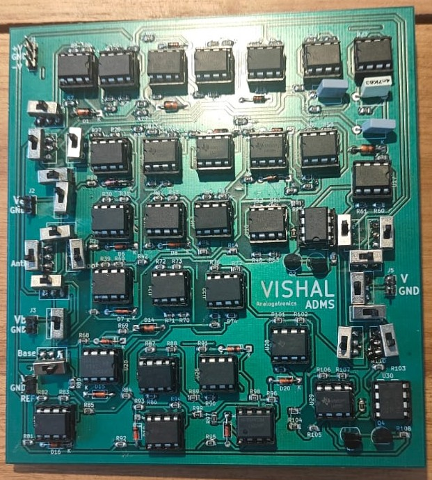

# Analog Calculator

## Summary
In a world dominated by digital microprocessors, this project explores the principles of analog computing by designing and constructing a functional, purely analog calculator. The core of the system is built around LM358 operational amplifiers configured with specific feedback networks of resistors, capacitors, and diodes. The calculator operates as a parallel processing system where all calculations happen simultaneously based on variable DC voltage or AC signal inputs. The system operates on a dual-rail +/-15V or 30V power supply, establishing a true 0V ground reference to simplify the circuit designs and eliminate the need for a virtual ground.

*Note regarding the power supply: While some project documentation may refer to a +/-30V power rail, the system actually operates on a +/-15V dual-rail supply (which provides a total 30V potential difference). This establishes a true 0V ground reference to simplify the circuit designs and eliminate the need for a virtual ground.*

## Mathematical Functions Supported
The calculator accepts numerical inputs (from 0.01V to 14V) and implements dedicated modular circuits to perform the following operations:
* **Addition:** Utilizes an inverting summing amplifier.
* **Subtraction:** Utilizes a difference amplifier to find the difference between two signals.
* **Multiplication:** Achieved using logarithmic principles (In(A * B) = In(A) + In(B)) via log, summing, and anti-log stages.
* **Division:** Similar to multiplication, but uses a subtraction (difference) stage for the log values.
* **Logarithm:** Uses the exponential current-voltage relationship of a semiconductor diode in the op-amp's feedback path.
* **Anti-Logarithm (Exponential):** Performs the inverse operation of the log amplifier to output an exponential function of the input.
* **Modulus (Absolute Value):** Implements a precision full-wave rectifier using op-amps and diodes.
* **Square Root & Any Root:** Uses an NMOS MOSFET in the feedback loop of the op-amp.
* **Integration:** Converts inputs like a square wave into a triangle wave using a capacitor in the feedback loop.
* **Differentiation:** Converts inputs like a triangle wave into a square wave using a capacitor at the input.

## Key Contributions
* **Parallel Computation Architecture:** Designed a system where buffered input signals are routed to all computational blocks simultaneously, ensuring no source-loading measurement errors.
* **Operation Selection:** Implemented a multi-position switch and an analog multiplexer (MUX) to allow users to select and view a single, clean result without circuit outputs conflicting.
* **Circuit Simulation:** Verified DC operating points, AC frequency responses, and transient behaviors of all individual blocks using LTspice prior to physical builds.
* **PCB Design:** Designed a comprehensive 2-layer PCB layout (11.5cm x 12.5cm) integrating all functional blocks and a dual-rail power supply.

## Results
* **Simulation Success:** LTspice simulations confirmed mathematical accuracy. For example, the adder successfully simulated 4 + 2 = 5.99V, the subtractor simulated 4 - 2 = 1.99V, and the differentiator successfully converted sine waves to cosine waves.
* **Hardware Preparation:** Successfully generated and verified the final Gerber files and Drill files for the PCB layout. 
* **Manufacturing Readiness:** Prepped the board for fabrication, estimating a cost of INR 2432 for standard manufacturing of 5 PCBs.

## Future Scope & Improvements
* **I/O Optimization via Multiplexing:** Integrate analog multiplexers (MUX) and demultiplexers (DEMUX) at the input and output stages to streamline user interaction and make the calculator more intuitive to use. To maintain signal integrity, appropriate compensating resistors will be added to counteract the tradeoff of lower voltages and inherent voltage drops across the MUX/DEMUX components.
* **Architectural Compaction & Resource Sharing:** Optimize the PCB layout and reduce the overall component count by reusing functional blocks. For example, instead of building separate adders for every module, the standalone adder circuit can be shared and routed to serve the internal summing stage of the multiplier and divider. This minimizes redundancy, reduces the footprint, and creates a highly compact design.
